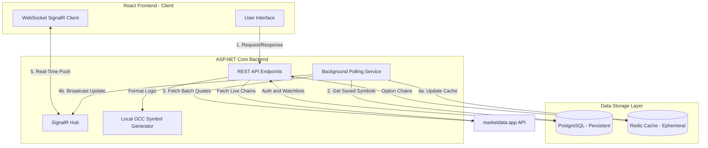

# Data Architecture

```mermaid
---
config:
  layout: fixed
---
flowchart TB
 subgraph Frontend["React Frontend - Client"]
        UI["User Interface"]
        WS_Client["WebSocket SignalR Client"]
  end
 subgraph Backend["ASP.NET Core Backend"]
        API["REST API Endpoints"]
        SignalR["SignalR Hub"]
        OCC_Gen["Local OCC Symbol Generator"]
        Worker["Background Polling Service"]
  end
 subgraph DataLayer["Data Storage Layer"]
        Postgres[("PostgreSQL - Persistent")]
        Redis[("Redis Cache - Ephemeral")]
  end
    UI -- "1. Request/Response" --> API
    WS_Client <-- "5. Real-Time Push" --> SignalR
    API <-- Auth and Watchlists --> Postgres
    API <-- Option Chains --> Redis
    API -- Format Logic --> OCC_Gen
    Worker -- "2. Get Saved Symbols" --> Postgres
    Worker -- "3. Fetch Batch Quotes" --> External["marketdata.app API"]
    Worker -- "4a. Update Cache" --> Redis
    Worker -- "4b. Broadcast Update" --> SignalR
    API -- Fetch Live Chains --> External
```
