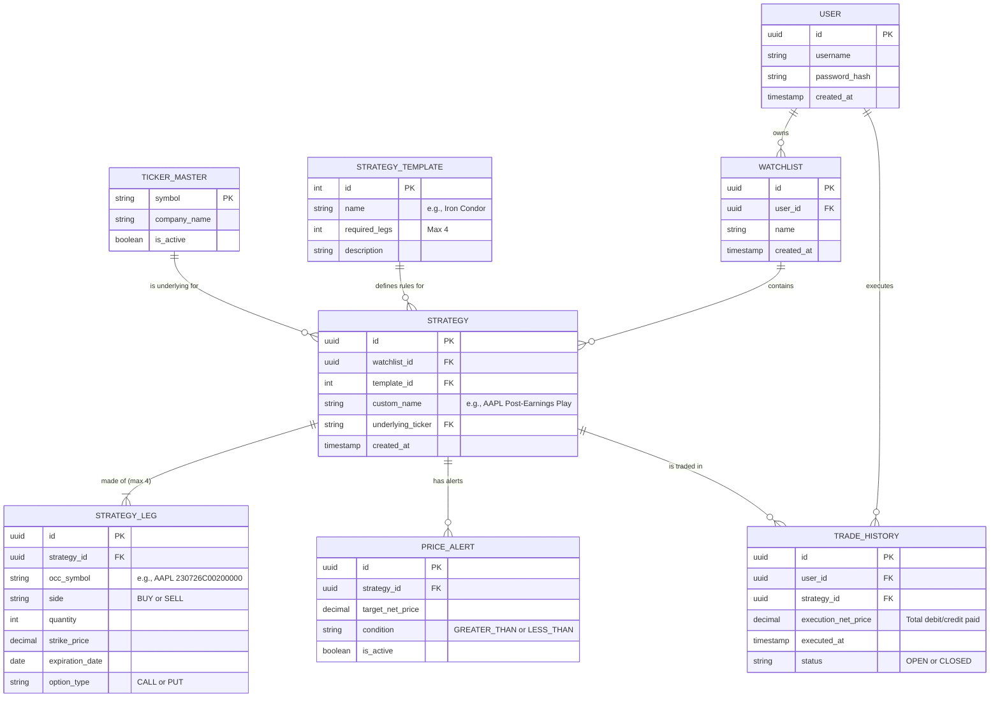

# ER Diagram

```mermaid
erDiagram
    %% Core Entities
    USER {
        uuid id PK
        string username
        string password_hash
        timestamp created_at
    }

    TICKER_MASTER {
        string symbol PK
        string company_name
        boolean is_active
    }

    %% Strategy Definition (The Solution to the if/else nightmare)
    STRATEGY_TEMPLATE {
        int id PK
        string name "e.g., Iron Condor"
        int required_legs "Max 4"
        string description
    }

    %% Watchlist System
    WATCHLIST {
        uuid id PK
        uuid user_id FK
        string name
        timestamp created_at
    }

    %% The Actual User Strategies
    STRATEGY {
        uuid id PK
        uuid watchlist_id FK
        int template_id FK
        string custom_name "e.g., AAPL Post-Earnings Play"
        string underlying_ticker FK
        timestamp created_at
    }

    STRATEGY_LEG {
        uuid id PK
        uuid strategy_id FK
        string occ_symbol "e.g., AAPL  230726C00200000"
        string side "BUY or SELL"
        int quantity
        decimal strike_price
        date expiration_date
        string option_type "CALL or PUT"
    }

    %% New Features
    PRICE_ALERT {
        uuid id PK
        uuid strategy_id FK
        decimal target_net_price
        string condition "GREATER_THAN or LESS_THAN"
        boolean is_active
    }

    TRADE_HISTORY {
        uuid id PK
        uuid user_id FK
        uuid strategy_id FK
        decimal execution_net_price "Total debit/credit paid"
        timestamp executed_at
        string status "OPEN or CLOSED"
    }

    %% Relationships
    USER ||--o{ WATCHLIST : "owns"
    USER ||--o{ TRADE_HISTORY : "executes"
    
    WATCHLIST ||--o{ STRATEGY : "contains"
    
    STRATEGY_TEMPLATE ||--o{ STRATEGY : "defines rules for"
    TICKER_MASTER ||--o{ STRATEGY : "is underlying for"
    
    STRATEGY ||--|{ STRATEGY_LEG : "made of (max 4)"
    STRATEGY ||--o{ PRICE_ALERT : "has alerts"
    STRATEGY ||--o{ TRADE_HISTORY : "is traded in"
```
